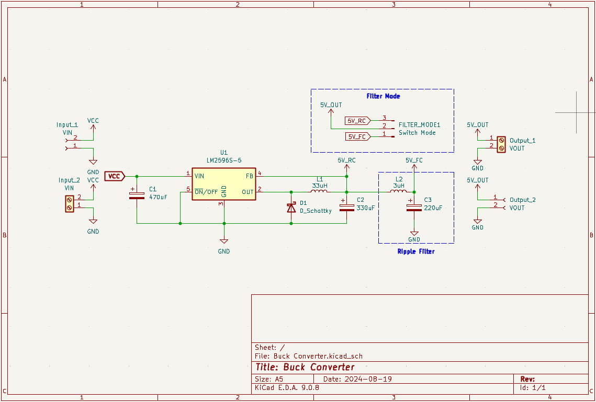
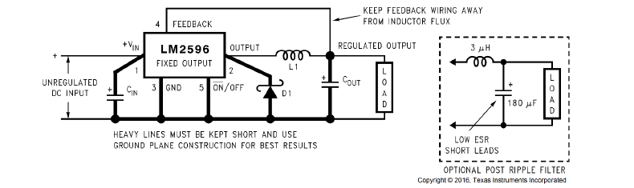
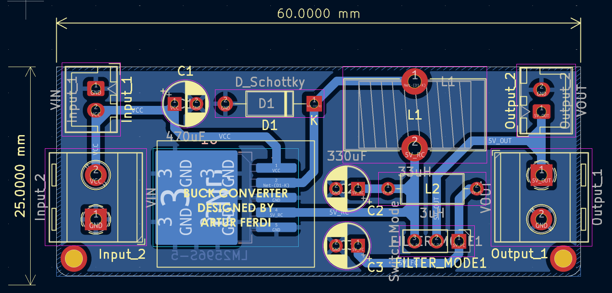

# LM2596-5 Fixed 5V Buck Converter

A compact step-down (buck) switching regulator based on the **Texas Instruments LM2596-5.0**, delivering a regulated **5V / 3A** output from an unregulated DC input up to 40V. Designed for embedded systems, IoT field devices, and general-purpose power supply applications.

---

## Table of Contents

- [Overview](#overview)
- [Schematic](#schematic)
- [PCB Design](#pcb-design)
- [Board Dimensions](#board-dimensions)
- [Bill of Materials (BOM)](#bill-of-materials-bom)
- [IC Electrical Characteristics](#ic-electrical-characteristics)
- [Application Design Notes](#application-design-notes)
  - [Input Capacitor (C_IN)](#input-capacitor-cin)
  - [Output Capacitor (C_OUT)](#output-capacitor-cout)
  - [Catch Diode (D1)](#catch-diode-d1)
  - [Inductor Selection](#inductor-selection)

---

## Overview

This module implements a **non-synchronous step-down DC-DC converter** using the LM2596-5.0 fixed-output variant. The LM2596 integrates all active functions for a buck regulator — including a fixed 150 kHz oscillator, internal error amplifier, and cycle-by-cycle current limiting — requiring only four external passive components.

| Parameter | Value |
|---|---|
| Topology | Non-synchronous Buck (Step-Down) |
| IC | LM2596-5.0 (TI) |
| Fixed Output Voltage | 5.0 V |
| Maximum Output Current | 3 A |
| Input Voltage Range | 7 V – 40 V |
| Switching Frequency | 150 kHz (fixed) |
| Output Voltage Accuracy | ±4% over line and load |
| Package | TO-220 (NDH) / TO-263 (KTT) |
| Thermal Protection | Yes (internal thermal shutdown) |
| Current Limit | Yes (two-stage frequency foldback) |
| Shutdown / Enable | Active-low via ON/OFF pin |

---

## Schematic



Also you can download the pdf schematic from `\PDF_Schematic`

The schematic follows the standard fixed-output buck topology per the LM2596 datasheet Figure 9-10:


---

## PCB Design



**Design rules and layout notes:**

- High-current paths (VIN → IC → L1 → VOUT and D1 freewheeling loop) use **wide copper pours** and are kept as short as possible to minimize parasitic inductance.
- The **output switch pin (Pin 1)** copper area is minimized to reduce EMI radiation from the switching node.
- C_IN and C_OUT are placed as close as possible to the IC with short return paths to GND.
- D1 (catch diode) is placed directly between Pin 2 (OUTPUT) and GND, adjacent to the IC.
- Feedback trace (Pin 4) is routed away from the inductor to prevent flux-induced noise coupling.
- **Ground plane** construction used for best noise performance.
- ON/OFF pin (Pin 5) tied to GND (regulator always enabled).
- TO-220 footprint includes heatsink pad clearance; TO-263 tab is thermally connected to a copper pour ≥ 0.4 in².

**Layer stackup:** 2-layer, 1 oz copper.

---

## Board Dimensions


| Parameter | Value |
|---|---|
| Board Size | 60 × 25 mm  |
| Mounting Holes | 2mm, 2× corner |
| Connector | Screw terminal (5.08 mm pitch), JST (2.54 mm pitch) |

---

## Bill of Materials (BOM)


| Ref | Description | Value / Part No. | Package | Qty |
|---|---|---|---|---|
| U1 | Buck Regulator IC | LM2596T-5.0/NOPB (TI) | TO-220 NDH | 1 |
| L1 | Power Inductor | 33 µH, 3.5 A | Through-hole (e.g. Renco RL-5472-4) | 1 |
| L2 | Power Inductor | 3 µH, 3.5 A | Through-hole  | 1 |
| D1 | Catch Diode | 1N5825, 5 A / 40 V Schottky | DO-201AD | 1 |
| C_IN | Input Bypass Capacitor | 470 µF / 50 V, low-ESR electrolytic | Radial | 1 |
| C_OUT | Output Filter Capacitor | 330 µF / 35 V, low-ESR electrolytic | Radial | 1 |
| C_Ripple | Ripple Filter Capacitor | 220 µF / 35 V, low-ESR electrolytic | Radial | 1 |
| J1 | Input Connector | Screw terminal, 2-pin, 5.08 mm | PCB mount | 1 |
| J2 | Input Connector | JST Connector, 2-pin, 2.54 mm | PCB mount | 1 |
| J3 | Output Connector | Screw terminal, 2-pin, 5.08 mm | PCB mount | 1 |
| J4 | Output Connector | JST Connector, 2-pin, 2.54 mm | PCB mount | 1 |

> Recommended capacitor series: **Panasonic HFQ** or **Nichicon PL** (low-ESR, switching-grade).

---

## IC Electrical Characteristics

All parameters per TI datasheet SNVS124G, T_J = 25°C unless otherwise noted.

### Absolute Maximum Ratings

| Parameter | Value | Unit |
|---|---|---|
| Maximum Supply Voltage (V_IN) | 45 | V |
| Maximum Junction Temperature | 150 | °C |
| Storage Temperature | –65 to +150 | °C |
| ESD (HBM) | ±2000 | V |

### Operating Conditions

| Parameter | Min | Max | Unit |
|---|---|---|---|
| Supply Voltage (V_IN) | 4.5 | 40 | V |
| Operating Temperature | –40 | +125 | °C |

### Electrical Characteristics — 5V Version

| Parameter | Min | Typ | Max | Unit | Conditions |
|---|---|---|---|---|---|
| Output Voltage (V_OUT) | 4.80 | 5.00 | 5.20 | V | 7 V ≤ V_IN ≤ 40 V, 0.2 A ≤ I_LOAD ≤ 3 A, T_J = 25°C |
| Output Voltage (V_OUT) | 4.75 | — | 5.25 | V | –40°C ≤ T_J ≤ 125°C |
| Output Current (I_LOAD) | — | — | 3 | A | Continuous DC |
| Efficiency (η) | — | 80 | — | % | V_IN = 12 V, I_LOAD = 3 A |
| Switching Frequency (f_O) | 127 | 150 | 173 | kHz | T_J = 25°C |
| Switching Frequency (f_O) | 110 | — | 173 | kHz | –40°C ≤ T_J ≤ 125°C |
| Peak Switch Current Limit | 3.6 | 4.5 | 6.9 | A | T_J = 25°C |
| Switch Saturation Voltage (V_SAT) | — | 1.16 | 1.40 | V | I_OUT = 3 A, T_J = 25°C |
| Standby Quiescent Current (I_STBY) | — | 80 | 200 | µA | ON/OFF = 5 V (disabled), T_J = 25°C |
| Operating Quiescent Current (I_Q) | — | 5 | 10 | mA | Switch ON |

### Thermal Information

| Package | θ_JA (typical) | θ_JC | Unit |
|---|---|---|---|
| TO-220 (NDH), no heatsink | 50 | 2 | °C/W |
| TO-263 (KTT), 0.5 in² copper | 50 | 2 | °C/W |
| TO-263 (KTT), 2.5 in² copper | 30 | 2 | °C/W |
| TO-263 (KTT), 3 in² double-sided | 20 | 2 | °C/W |

> **Note:** The TO-220 package requires an external heatsink under most operating conditions. Refer to Figure 9-18 in the LM2596 datasheet for junction temperature rise curves.

---

## Application Design Notes

### Input Capacitor (C_IN)

A **low-ESR aluminum electrolytic or solid tantalum** capacitor is mandatory between V_IN (Pin 1) and GND (Pin 3) to suppress switching transients and supply instantaneous switch-on current.

**Selection criteria:**
- **RMS current rating** ≥ 50% of DC load current (I_LOAD × 0.5). At 3 A load: I_RMS(min) = 1.5 A.
- **Voltage rating** ≥ 1.5 × V_IN(max). At 12 V input: V_rating ≥ 18 V → use 25 V or 35 V rated capacitor.
- Electrolytic capacitors must be rated for switching regulator duty (low-ESR series).

| Input Voltage (V_IN max) | Recommended Capacitor | Series |
|---|---|---|
| 10 V | 560 µF / 16 V | Panasonic HFQ / Nichicon PL |
| 15 V | 470 µF / 25 V | Panasonic HFQ / Nichicon PL |
| 25 V | 680 µF / 35 V | Panasonic HFQ / Nichicon PL |
| 40 V | 470 µF / 50 V | Panasonic HFQ / Nichicon PL |

> **Caution:** Avoid high-capacitance ceramic (MLCC) capacitors alone at V_IN — they can cause severe ringing at the input pin due to low ESR interacting with PCB inductance.

---

### Output Capacitor (C_OUT)

The output capacitor filters the inductor ripple current and directly determines output voltage ripple. **ESR is the most critical parameter.**

**Selection criteria:**
- ESR determines output ripple voltage: `V_ripple = ΔI_IND × ESR_COUT`
- Target ESR ≈ 0.1 Ω for ripple < 1% of V_OUT (50 mV pp at 5 V output).
- Capacitance range: **82 µF – 820 µF**. Do not exceed 820 µF.
- Voltage rating ≥ 1.5 × V_OUT → minimum 7.5 V. Use ≥ 25 V rated capacitor for low ESR.

| Load Current | Max V_IN | Recommended Capacitor | Inductor |
|---|---|---|---|
| 3 A | 8 V | 470 µF / 25 V | 22 µH (L41) |
| 3 A | 10 V | 560 µF / 25 V | 22 µH (L41) |
| 3 A | 15 V | 330 µF / 35 V | 33 µH (L40) |
| 3 A | 40 V | 330 µF / 35 V | 47 µH (L39) |
| 2 A | 20 V | 180 µF / 35 V | 68 µH (L38) |
| 2 A | 40 V | 180 µF / 35 V | 68 µH (L38) |

> Source: LM2596 datasheet Table 9-3 (5 V section).

> **Cold temperature note:** Below –25°C, ESR of aluminum electrolytics increases 3–10×. Use **solid tantalum capacitors** (AVX TPS or Sprague 595D series) for industrial/field deployments operating below –25°C.

---

### Catch Diode (D1)

The catch diode provides the freewheeling current path for the inductor when the internal switch is OFF. It must be **fast** and placed with minimal lead length adjacent to Pin 2 (OUTPUT) and GND.

**Selection criteria:**
- Current rating ≥ 1.3 × I_LOAD(max) → ≥ 3.9 A. Use a 5 A rated diode.
- Reverse voltage rating ≥ 1.25 × V_IN(max).
- **Schottky diodes strongly preferred** — low V_F reduces conduction loss and improves efficiency at 5 V output.
- Ultra-fast recovery types (t_rr ≤ 50 ns) are acceptable if Schottky is unavailable.
- **Do not use 1N5400-series or 1N4001-series** rectifiers — reverse recovery time is too slow for 150 kHz operation.

| V_IN (max) | Recommended Schottky | Rating |
|---|---|---|
| ≤ 20 V | 1N5823 | 5 A / 20 V |
| ≤ 30 V | 1N5824 | 5 A / 30 V |
| ≤ 40 V | **1N5825** *(default)* | 5 A / 40 V |
| ≤ 50 V | SB550 | 5 A / 50 V |

---

### Inductor Selection

The inductor is selected from TI's nomograph (Figure 9-6, LM2596-5.0) based on **maximum input voltage** and **maximum load current**, targeting continuous conduction mode (CCM).

**Inductor code reference (5 V output):**

| Inductance | Current Rating | Inductor Code | Applicable Region (5 V) |
|---|---|---|---|
| 22 µH | 3.50 A | L41 | V_IN ≤ 10 V, I_LOAD ≤ 3 A |
| 33 µH | 3.50 A | L40 | V_IN ≤ 15 V, I_LOAD ≤ 3 A |
| 47 µH | 3.50 A | L39 | V_IN ≤ 40 V, I_LOAD ≤ 3 A |
| 22 µH | 3.10 A | L33 | V_IN ≤ 9 V, I_LOAD ≤ 2 A |
| 68 µH | 3.10 A | L38 | V_IN ≤ 40 V, I_LOAD ≤ 2 A |

**Manufacturer cross-reference (33 µH / L40):**

| Manufacturer | Through-Hole P/N | Surface-Mount P/N |
|---|---|---|
| Schott | 67144220 | 67148290 |
| Renco | RL-5472-4 | — |
| Pulse Engineering | PE-54040 | PE-54040-S |

**Key formulas:**

Peak switch current:
```
I_peak = I_LOAD + (ΔI_IND / 2)
```

Minimum load for CCM:
```
I_LOAD(min, CCM) = ΔI_IND / 2
```

Output ripple voltage:
```
V_ripple = ΔI_IND × ESR_COUT
```

Required ESR for target ripple:
```
ESR_COUT = V_ripple(target) / ΔI_IND
```

> **Core type recommendation:** Use toroid or E-core (closed magnetic structure) to prevent inductor flux from coupling into the feedback trace, GND path, or output capacitor wiring. Open-core (bobbin/stick) inductors are acceptable in single-regulator designs with careful layout.

---

## License

[MIT](LICENSE) — Hardware design files and documentation are open for modification and redistribution with attribution.

---

## References

- Texas Instruments, *LM2596 SIMPLE SWITCHER® Power Converter 150-kHz 3-A Step-Down Voltage Regulator*, Datasheet SNVS124G, Rev. G, March 2023.
